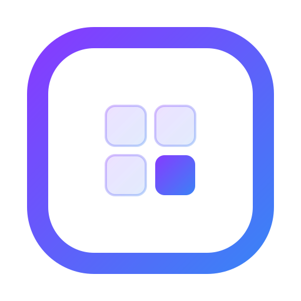

<div align="center">

  

  # Frame 📖

  **A minimalist, aesthetic, and highly interactive personal logging and habit tracking application.**

  [](https://metanef.github.io/frame/)
  [](https://github.com/metanef/frame)

  <br />

  [](#)
  [](#)
  [](#)
  [](#)
  [](#)
  [](#)

</div>

---

## 🌐 Live Demo & Installation

Try the application directly: **[Frame](https://metanef.github.io/frame/)**

### 📱 100% Local, Offline & Installable (PWA)
- **Runs 100% Locally**: Once visited or installed, the application is cached on your device via the Service Worker. You do **not** need an internet connection to open or use Frame.
- **Installable (PWA)**: Install Frame as a native-feeling standalone app directly from your browser:
  - **iOS (Safari)**: Tap *Share* ➔ *Add to Home Screen*.
  - **Android (Chrome)**: Tap *Install* or use the *Install application* button in Settings.
  - **Desktop (Chrome/Edge/Brave)**: Click the *Install* icon in the address bar or within the Settings screen.

---

## 🔒 100% Safe, Private & Local-First

> **Your personal habits, journal entries, and reflections belong to you and only you.**

- 🛡️ **Zero Server Transit**: Absolutely nothing is ever transmitted to any remote server, backend, or cloud database.
- 💾 **100% Local Storage (IndexedDB)**: All daily logs, habit metrics, mood ratings, and notes reside strictly inside your device's browser storage via **Dexie.js**.
- 🚫 **Zero Tracking & No Telemetry**: No third-party cookies, no advertising SDKs, and zero telemetry collection.
- ✈️ **Full Offline Autonomy**: Operates seamlessly in flight mode or with no connectivity.
- 📦 **Total Data Sovereignty**: Easily backup, transfer, or restore your entire journal via standard JSON files with zero platform lock-in.

---

## ✨ Features

- **📖 Interactive Home Page**: An animated, physical-looking 3D book interface to open your personal journal.
- **📅 Multi-Scale Calendar View**:
  - **Year View**: A responsive grid of 12 mini-months of colored cubes to visualize consistency at a glance, with quick Month View navigation.
  - **Month View**: A colorful monthly calendar colored based on the daily completion score.
  - **Week View**: Detailed daily habit statuses tracking throughout the week.
- **✍️ Comprehensive Day Page**:
  - Checklists for active habits (divided into positive Objectives and negative Bad Habits to avoid).
  - Interactive mood selector with expressive emojis.
  - Numbered day rating (score out of 10).
  - Structured reflection areas: "Regrets" (what didn't work) and "Achievements" (what you are proud of).
- **📊 Stats & Gamification**:
  - **Experience (XP) System**: Progress through 5 tiers (from *Rookie* to *Legend*).
  - **KPIs & Trends**: Real-time tracking of current/best streaks, overall success rate, and last 7 days trend.
  - **Badges**: 12 unique unlockable badges based on your achievements and consistency (e.g., *First Flame*, *Perfect Week*, *Iron Will*).
- **⚙️ Habit Manager**: Complete habit customization (enable/disable, positive/negative valence, and multiple tracking units like Yes/No, Counter, Duration, and Pages).

---

## 🛠️ Tech Stack

| Technology | Usage |
| :--- | :--- |
| **React 19** | Composable UI framework (Single Page Application) |
| **Vite** | Ultra-fast build tool and dev server |
| **Dexie.js** | Robust IndexedDB wrapper for local-first persistent storage |
| **Zustand** | Lightweight global state management |
| **Tailwind CSS** | Modern premium dark theme styling & custom layout |
| **Framer Motion** | Smooth animations (e.g., page transitions, 3D book opening) |
| **Oxlint** | Blazing fast static analysis and code quality linting |

---

## 🚀 Running Locally

```bash
# 1. Install dependencies
npm install

# 2. Start development server
npm run dev

# 3. Production Build
npm run build

# 4. Code Quality (Linting)
npm run lint
```

Open `http://localhost:5173` in your browser.

---

## 🗺️ Roadmap & TODO

### ✅ Done

#### 🚀 Major Updates
- [x] **PWA Offline Support**: Add service workers (`vite-plugin-pwa`) for offline-first capabilities.
- [x] **English Translation (i18n)**: Fully translated UI screens (Home, Calendar, Day, Stats, Settings) and seeded database habits to English.
- [x] **Year View Overhaul**: Replaced the 53-week contribution graph with a responsive, clickable 12 mini-months layout optimized for mobile screens.
- [x] **Gamification System**: Local-first badges triggers and experience progression logic.
- [x] **Realistic Book Opening Animation**: Overhauled the 3D book cover transition with nested motion containers to zoom full-screen first and then rotate open seamlessly like a real journal page.
- [x] **Data Import & Backups**: Implemented full JSON import/export system with transaction safety to easily back up, restore, and migrate habit data between devices.

#### 🛠️ Minor Updates & Polish
- [x] **Neutral Color for Empty Days**: Days with no logged entries are rendered as neutral gray in calendar grids rather than counted as failures (red).
- [x] **Streak Calculation**: Streamlined streak and success rate computations to respect unlogged days correctly.
- [x] **Tactile Animation & Rendering Polish**: Eliminated text pixelation during zooms using 2x super-resolution assets/scales, and eliminated the "fade to black" transition blink by rendering the calendar screen in the background under a fading backdrop overlay.
- [x] **Persistent Navigation & Global Stats**: Added the Statistics shortcut button at the bottom of all calendar views (Year, Month, Week) and implemented smart back-navigation history.
- [x] **TopBar Layout Cleanup**: Removed the redundant three-dots menu button on Statistics, Settings, and Day screens while maintaining centered titles using invisible spacers.
- [x] **Home Screen Navigation**: Repositioned the habit streak pill to the top-left and introduced a settings gear button in the top-right for intuitive access.

### 🔄 Planned

#### 🚀 Major Updates

#### 🛠️ Minor Updates & Polish
- [ ] **Notifications**: Reminders to log habits.
